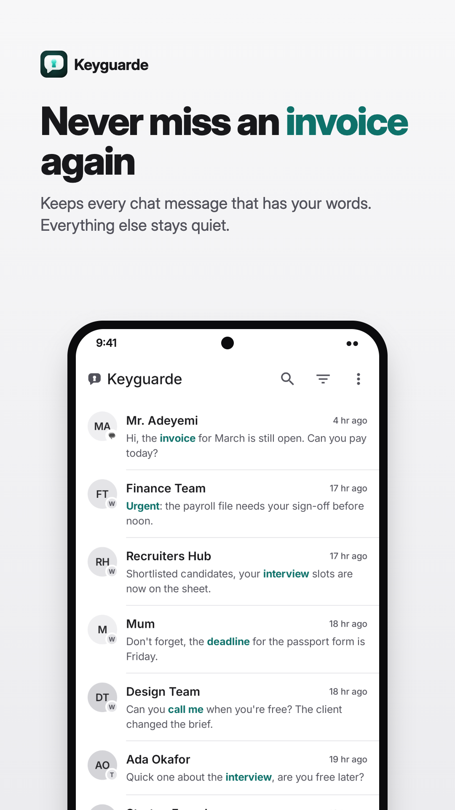
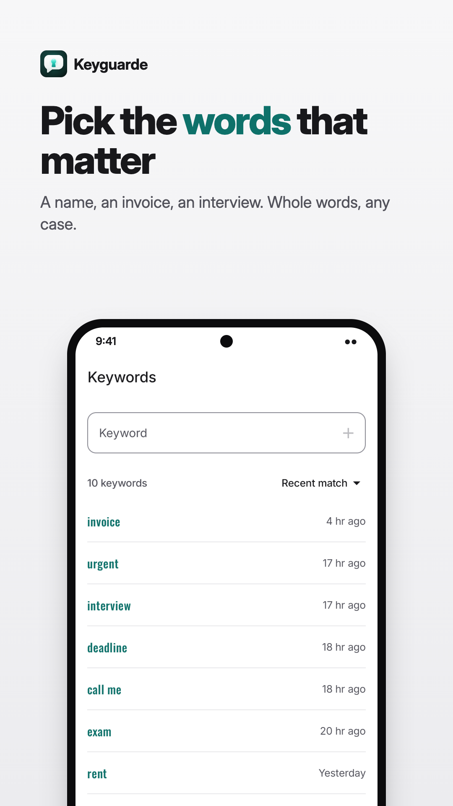
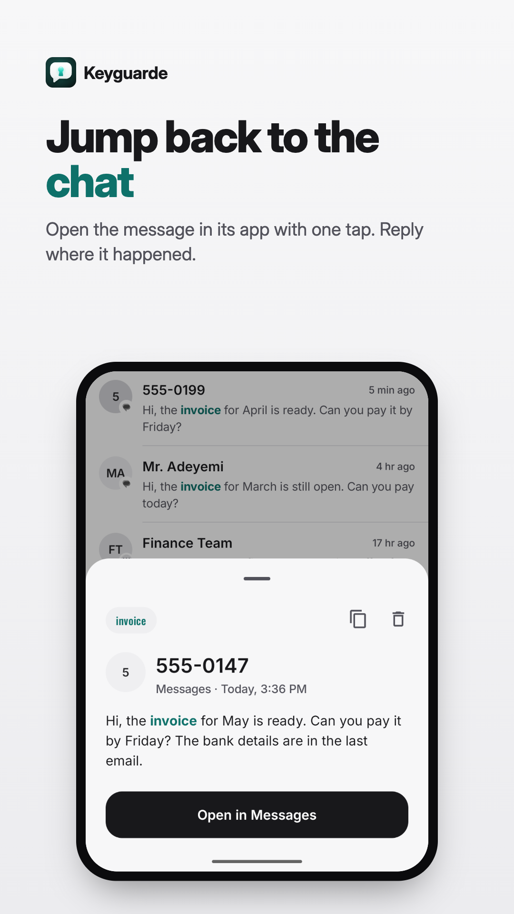

# Keyguarde: Chat Keyword Alerts

Keyguarde watches your chat notifications for the words you pick, and keeps every message that has one. Everything else stays quiet.

Busy WhatsApp and Telegram groups bury the one message you care about: the invoice, the interview, the deadline. Keyguarde catches it the moment it arrives and keeps it in one list.

[](https://play.google.com/store/apps/details?id=dev.logickoder.keyguarde)

<p>
  
  
  
</p>

## What it does

- **Keyword alerts.** Pick words like "invoice" or "interview". A message with one shows up in Matches, with the word highlighted. Matching is whole word and ignores case.
- **Only the apps you choose.** WhatsApp, Telegram, Messages or any chat app. Everything else is ignored.
- **Jump back to the chat.** Open a match in its app while the notification is still live.
- **Search, filter, clean up.** Search matches, filter by app or keyword, select and delete with undo.
- **Know it's working.** Settings runs a live test, warns when Android stops the listener, and helps lift battery limits.
- **Pause any time.** Stop catching messages without losing your setup.
- **Light and dark themes.**

## Privacy

Your messages, matches and keywords stay on your phone. Keyguarde has no server and no account, and its data is left out of Android backups.

The app uses Google services: Firebase Analytics (screens viewed and features used), Crashlytics, Performance Monitoring and AdMob for the banner ad. None of them receive message text, chat names or keywords. The full list is in the [privacy policy](https://logickoder.dev/keyguarde/#/privacy-policy).

## How it works

Keyguarde is a notification listener. Android hands it each new notification from the apps you pick. It checks the text against your keywords on the device and saves the matches to a local database. It can't open your chats or read older messages.

## Project layout

- `app/`: the Android app. Kotlin, Jetpack Compose, Material 3, Navigation 3, Room, Paging, DataStore.
- `website/`: the site at [logickoder.dev/keyguarde](https://logickoder.dev/keyguarde/). Vite, React, Tailwind.
- `docs/brand/`: logo sources, the Play icon and the Play listing assets.

## Building

The app needs JDK 17 and a recent Android Studio. It targets SDK 37 and runs on Android 8.0 (API 26) and up.

1. Firebase needs `app/google-services.json`, which is gitignored. Create a Firebase project with Android apps `dev.logickoder.keyguarde` and `dev.logickoder.keyguarde.dev` (debug builds), and put its config file there.
2. Build and test:

   ```bash
   ./gradlew :app:assembleDebug :app:lintDebug :app:testDebugUnitTest
   ```

Debug builds install as "Keyguarde (Dev)" next to the store version, and fill the database with sample matches on first run.

The website:

```bash
cd website
cp .env.example .env   # optional: Firebase web config for analytics
pnpm install
pnpm dev
```

## Contributing

Bug reports, ideas and pull requests are welcome. See [CONTRIBUTING.md](CONTRIBUTING.md). Design tokens are in [THEMING.md](THEMING.md).

## License

Licensed under [Creative Commons Attribution 4.0 International (CC BY 4.0)](LICENSE). You can use, share and remix it, even commercially, with credit.
